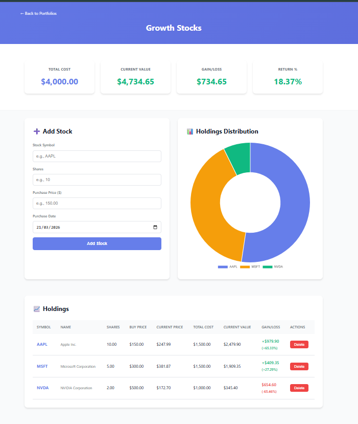
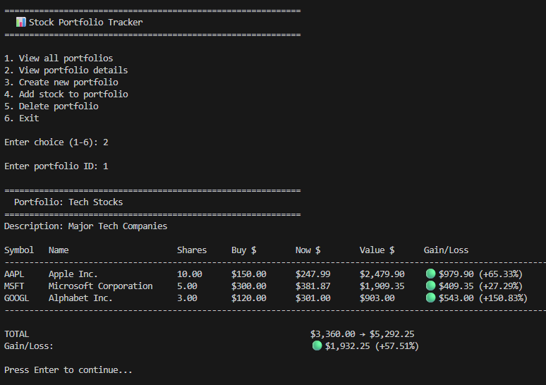

# 📊 Stock Portfolio Tracker

A full-stack web application for tracking stock portfolios in real-time. Built with **Python Flask** backend and **vanilla JavaScript** frontend, featuring live stock price integration and portfolio analytics.


## 🎯 Features

### Core Functionality
- ✅ **Portfolio Management** - Create and manage multiple stock portfolios
- ✅ **Real-time Stock Prices** - Live data from Yahoo Finance API
- ✅ **Gain/Loss Tracking** - Automatic calculation of profits and losses
- ✅ **Visual Analytics** - Interactive pie charts showing portfolio distribution
- ✅ **Historical Tracking** - Monitor portfolio value over time

### Technical Highlights
- 🐍 **Flask REST API** - Clean, well-structured backend endpoints
- 💾 **SQLAlchemy ORM** - Elegant database abstraction with relationships
- 📊 **Chart.js Integration** - Beautiful, responsive data visualizations
- 🎨 **Modern UI** - Gradient design with smooth animations
- 📱 **Responsive Design** - Works seamlessly on desktop and mobile
- 🖥️ **CLI Interface** - Alternative command-line interface included

## 🛠️ Tech Stack

### Backend
- **Python 3.12** - Core language
- **Flask 3.0** - Web framework
- **SQLAlchemy** - ORM for database operations
- **SQLite** - Lightweight database
- **yfinance** - Yahoo Finance API wrapper

### Frontend
- **HTML5 / CSS3** - Modern, semantic markup
- **Vanilla JavaScript** - No framework dependencies
- **Chart.js** - Data visualization library

## 📊 Screenshots

### Portfolio List


### Portfolio Detail with Analytics


### CLI Interface


## 🚀 Getting Started

### Prerequisites
- [Python 3.10+](https://www.python.org/downloads/)
- A code editor (VS Code recommended)

### Installation

1. **Clone the repository**
```bash
   git clone https://github.com/Nathan-Forest/StockTracker.git
   cd StockTracker
```

2. **Create virtual environment**
```bash
   python -m venv venv
```

3. **Activate virtual environment**
   
   **Windows (PowerShell):**
```powershell
   .\venv\Scripts\Activate.ps1
```
   
   **Windows (Command Prompt):**
```cmd
   .\venv\Scripts\activate.bat
```
   
   **macOS/Linux:**
```bash
   source venv/bin/activate
```

4. **Install dependencies**
```bash
   pip install -r requirements.txt
```

5. **Run the application**
   
   **Web Interface:**
```bash
   python app.py
```
   Then open http://localhost:5000 in your browser
   
   **CLI Interface:**
```bash
   python cli.py
```

## 📚 API Documentation

### Base URL
```
http://localhost:5000/api
```

### Endpoints

#### Portfolios

| Method | Endpoint | Description |
|--------|----------|-------------|
| GET | `/portfolios` | Get all portfolios |
| POST | `/portfolios` | Create new portfolio |
| DELETE | `/portfolios/{id}` | Delete portfolio |
| GET | `/portfolios/{id}/summary` | Get portfolio with analytics |
| GET | `/portfolios/{id}/history` | Get historical values |

#### Stocks

| Method | Endpoint | Description |
|--------|----------|-------------|
| POST | `/portfolios/{id}/stocks` | Add stock to portfolio |
| DELETE | `/portfolios/{id}/stocks/{stock_id}` | Remove stock |

### Sample Requests

**Create Portfolio**
```http
POST /api/portfolios
Content-Type: application/json

{
  "name": "Tech Stocks",
  "description": "Major technology companies"
}
```

**Add Stock**
```http
POST /api/portfolios/1/stocks
Content-Type: application/json

{
  "symbol": "AAPL",
  "shares": 10,
  "purchase_price": 150.00,
  "purchase_date": "2024-01-15"
}
```

**Get Portfolio Summary**
```http
GET /api/portfolios/1/summary
```

**Response:**
```json
{
  "portfolio": {
    "id": 1,
    "name": "Tech Stocks",
    "description": "Major technology companies"
  },
  "stocks": [
    {
      "symbol": "AAPL",
      "name": "Apple Inc.",
      "shares": 10,
      "purchase_price": 150.00,
      "current_price": 175.43,
      "total_cost": 1500.00,
      "current_value": 1754.30,
      "gain_loss": 254.30,
      "gain_loss_percent": 16.95
    }
  ],
  "total_cost": 1500.00,
  "total_value": 1754.30,
  "total_gain_loss": 254.30,
  "total_gain_loss_percent": 16.95
}
```

## 🗂️ Project Structure
```
StockTracker/
├── models/                  # Data models
│   ├── database.py         # SQLAlchemy models (Portfolio, Stock, PriceHistory)
│   └── __init__.py
├── data/                    # Database operations
│   └── db_manager.py       # Database CRUD operations
├── services/                # Business logic
│   └── portfolio_service.py # Portfolio calculations & analytics
├── templates/               # HTML templates
│   ├── index.html          # Portfolio list page
│   └── portfolio.html      # Portfolio detail page
├── static/                  # Frontend assets
│   ├── css/
│   │   └── style.css       # Styling
│   └── js/
│       └── app.js          # Frontend logic
├── stock_fetcher.py         # Yahoo Finance API integration
├── app.py                   # Flask web server
├── cli.py                   # Command-line interface
├── requirements.txt         # Python dependencies
└── README.md
```

## 🎨 Features in Detail

### Real-time Stock Data
Integration with Yahoo Finance API provides:
- Current stock prices
- Daily price changes
- Company names and metadata
- Automatic updates on page load

### Portfolio Analytics
Comprehensive calculations including:
- Total investment cost
- Current portfolio value
- Absolute gain/loss (in dollars)
- Percentage returns
- Per-stock performance metrics

### Visual Reporting
Interactive charts showing:
- Portfolio distribution by stock
- Proportional holdings visualization
- Color-coded performance indicators

### Data Persistence
SQLAlchemy ORM with SQLite provides:
- Automatic table creation
- Relationship management (one-to-many)
- Query optimization
- Easy migration to PostgreSQL/MySQL for production

## 🔄 Database Schema

### Portfolios Table
| Column | Type | Description |
|--------|------|-------------|
| id | INTEGER | Primary key |
| name | VARCHAR | Portfolio name |
| description | VARCHAR | Optional description |
| created_date | DATETIME | Creation timestamp |

### Stocks Table
| Column | Type | Description |
|--------|------|-------------|
| id | INTEGER | Primary key |
| symbol | VARCHAR | Stock ticker symbol |
| shares | FLOAT | Number of shares |
| purchase_price | FLOAT | Price per share at purchase |
| purchase_date | DATETIME | Purchase date |
| portfolio_id | INTEGER | Foreign key to Portfolios |

### PriceHistory Table
| Column | Type | Description |
|--------|------|-------------|
| id | INTEGER | Primary key |
| portfolio_id | INTEGER | Foreign key to Portfolios |
| total_value | FLOAT | Portfolio value snapshot |
| recorded_date | DATETIME | Snapshot timestamp |

## 🧪 Development

### Virtual Environment
The project uses Python virtual environments for dependency isolation:
```bash
# Create
python -m venv venv

# Activate (Windows)
.\venv\Scripts\Activate.ps1

# Activate (macOS/Linux)
source venv/bin/activate

# Deactivate
deactivate
```

### Dependencies
Install all dependencies:
```bash
pip install -r requirements.txt
```

Key packages:
- `Flask` - Web framework
- `SQLAlchemy` - ORM
- `yfinance` - Stock data
- `pandas` - Data analysis
- `flask-cors` - CORS handling

### Database
The SQLite database is automatically created on first run. To reset:
```bash
# Delete database
rm stocktracker.db

# Restart app to recreate
python app.py
```

## 🎯 Use Cases

### Personal Investment Tracking
- Track multiple portfolios (retirement, growth, dividend, etc.)
- Monitor performance in real-time
- Visualize asset allocation

### Learning Tool
- Practice stock trading without risk
- Understand portfolio diversification
- Learn about market movements

### Development Portfolio
- Demonstrates full-stack Python development
- Shows API integration skills
- Exhibits database design knowledge
- Proves frontend development capabilities

## 🎓 Learning Outcomes

This project demonstrates:
- ✅ **Full-stack Python development** - Flask backend + JavaScript frontend
- ✅ **RESTful API design** - Clean, documented endpoints
- ✅ **ORM usage** - SQLAlchemy for database abstraction
- ✅ **Database relationships** - One-to-many modeling
- ✅ **External API integration** - Yahoo Finance data
- ✅ **Data visualization** - Chart.js implementation
- ✅ **Responsive web design** - Mobile-friendly interface
- ✅ **Business logic** - Financial calculations
- ✅ **Error handling** - Graceful failure management
- ✅ **Code organization** - MVC pattern separation

## 🔮 Future Enhancements

- [ ] User authentication and authorization
- [ ] Multiple currency support
- [ ] Cryptocurrency tracking
- [ ] Email alerts for price thresholds
- [ ] Historical performance charts (line graphs over time)
- [ ] Export to CSV/PDF
- [ ] Dividend tracking
- [ ] Stock news integration
- [ ] Mobile app (React Native)
- [ ] Deployment to cloud (AWS/Azure/Heroku)

## 🤝 Comparison to C# Version

This project complements my [FinanceHub](https://github.com/Nathan-Forest/FinanceHub) project, which is built with C# ASP.NET Core. Both demonstrate full-stack capabilities:

| Feature | FinanceHub (C#) | StockTracker (Python) |
|---------|----------------|---------------------|
| **Backend** | ASP.NET Core | Flask |
| **ORM** | Entity Framework | SQLAlchemy |
| **Database** | SQLite | SQLite |
| **Frontend** | Vanilla JS | Vanilla JS |
| **Domain** | Personal Finance | Stock Portfolio |
| **Type System** | Static typing | Dynamic typing (with type hints) |

Both projects showcase understanding of:
- MVC architecture
- REST API design
- Database relationships
- Frontend/backend integration
- Data visualization

## 👨‍💻 Author

**Nathan Forest**
- GitHub: [@Nathan-Forest](https://github.com/Nathan-Forest)
- LinkedIn: [Nathan Forest](https://linkedin.com/in/nathan-forest-australia)

## 📄 License

This project is open source and available under the [MIT License](LICENSE).

## 🙏 Acknowledgments

- Built as part of my transition from IT Support to Software Development
- Demonstrates Python full-stack development alongside my C# projects
- Yahoo Finance API for providing free stock data
- Chart.js for beautiful data visualizations
- Flask and SQLAlchemy communities for excellent documentation

---

⭐ If you found this project helpful, please consider giving it a star!

**Portfolio Projects:**
1. [Invoice Validator](https://github.com/Nathan-Forest/invoice-validator) - Node.js with Jest testing
2. [Expense Tracker](https://github.com/Nathan-Forest/expense-tracker) - JavaScript (deployed live)
3. [Dice Game](https://github.com/Nathan-Forest/dice-game) - C# console application
4. [FinanceHub](https://github.com/Nathan-Forest/FinanceHub) - C# ASP.NET Core full-stack
5. **StockTracker** - Python Flask full-stack _(this project)_